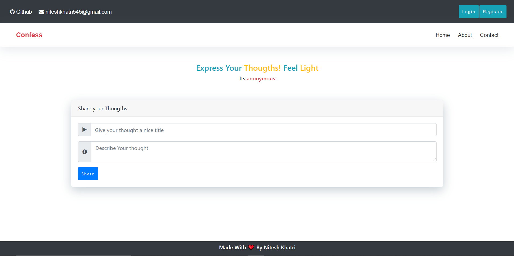
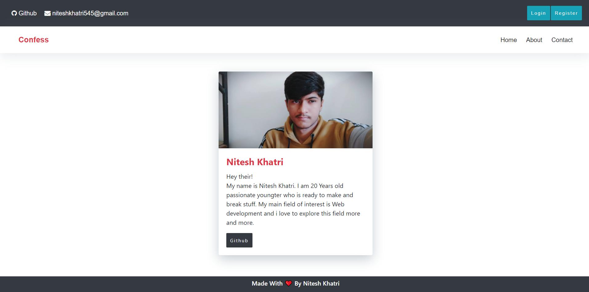
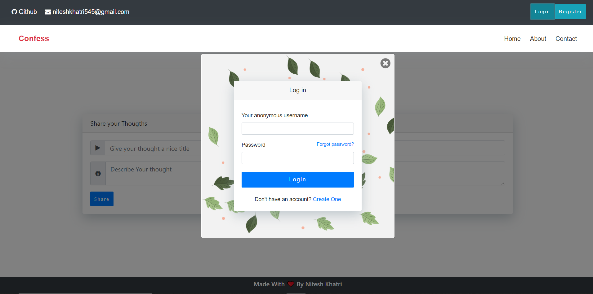

# Node Js Website

#### Heroku link - https://confess-thoughts.herokuapp.com/

## About the project
- This project was a part of class assignment during one of my semester of BCA
- The project is made using Node, Express and handlebars
- This is more of a frontend design project and is not connected to the database.

### Few Screenshots

