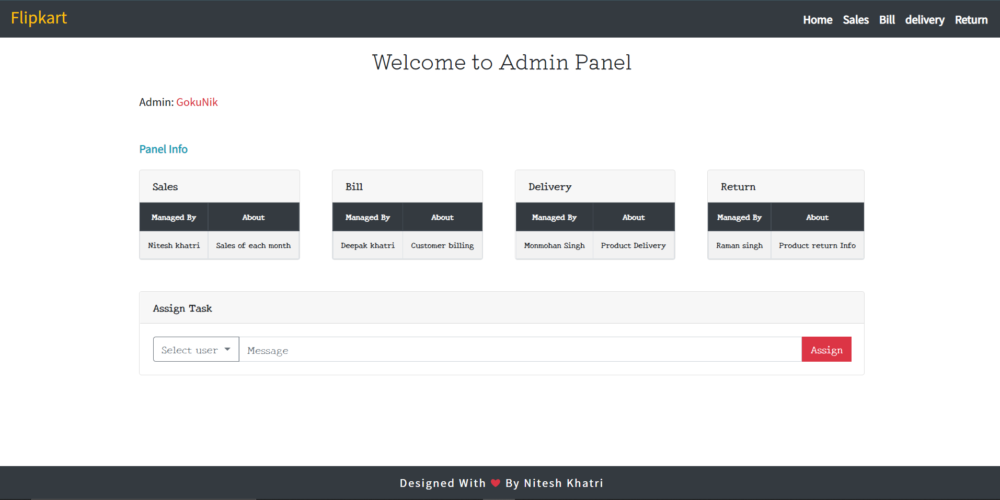
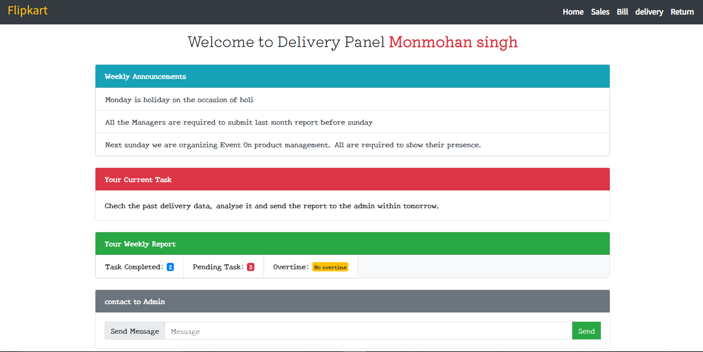

# Online store backend Website

#### Heroku Link - https://nitesh-khatri-11813971.herokuapp.com/
## About the project
- This project was a part of class assignment during one of my semester of BCA
- The project is made using Node, Express and handlebars
- In this project I am supposed to display data passed from the index.js to different pages using handlebars.
- Each page should show the data passed for that specific page.

### Few Screenshots

